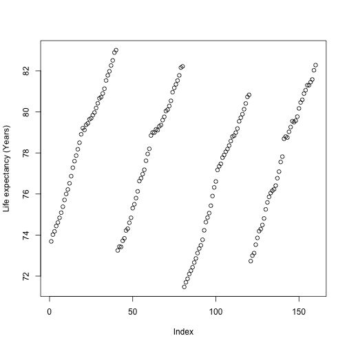
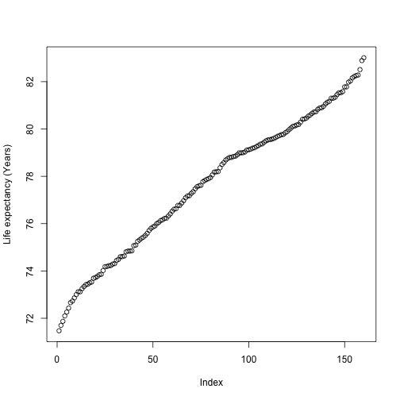
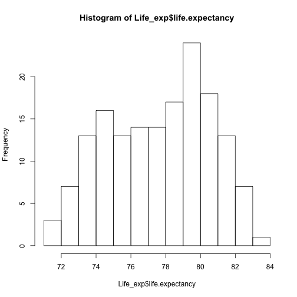
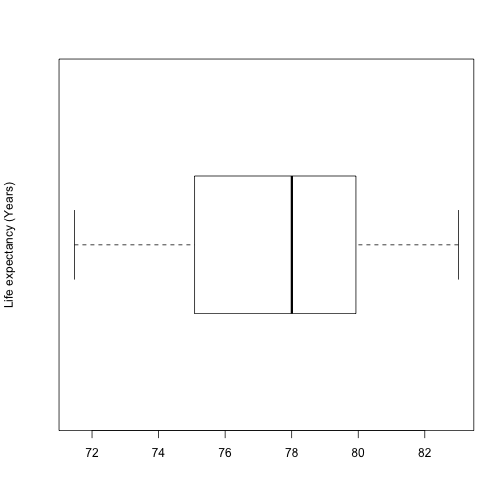
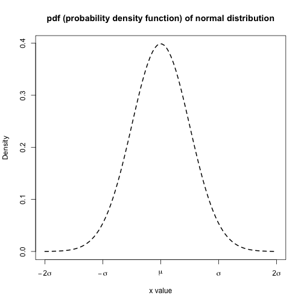

Session1: Describe the Data
========================================================
author: MRC Clinical Sciences Centre (http://mrccsc.github.io/)
date: 12/July/2016
width: 1440
height: 1100
autosize: true
font-import: <link href='http://fonts.googleapis.com/css?family=Slabo+27px' rel='stylesheet' type='text/css'>
font-family: 'Slabo 27px', serif;
css:style.css

Outline
========================================================

- Session1: data summary

- Session2: hypothesis testing and ANOVA

- Session3: correlation and linear regression

Materials.
========================================================
id: materials

All prerequisites, links to material and slides for this course can be found on github.
* [Reproducible-R](http://mrccsc.github.io/Reproducible-R/)

Or can be downloaded as a zip archive from here.
* [Download zip](https://github.com/mrccsc/Reproducible-R/zipball/master)

Materials. - Presentations, source code and practicals.
========================================================

Once the zip file in unarchived. All presentations as HTML slides and pages, their R code and HTML practical sheets will be available in the directories underneath.

* **presentations/slides/**
Presentations as an HTML slide show.
* **presentations/singlepage/**
Presentations as an HTML single page.
* **presentations/rcode/**
R code in presentations.
* **exercises/**
Practicals as HTML pages.
* **answers/**
Practicals with answers as HTML pages and R code solutions.

Set the Working directory
========================================================

Before running any of the code in the practicals or slides we need to set the working directory to the folder we unarchived.

You may navigate to the unarchived Reproducible-R folder in the Rstudio menu

**Session -> Set Working Directory -> Choose Directory**

or in the console.


```r
setwd("/CSC/workshop/StatInR")
# e.g. setwd("~/Downloads/StatInR")
```

Session1 - data summary
========================================================

- data type

- spread of data

- shape of data

- distribution


Data type
========================================================

data type

- continuous

eg. blood pressure, body weight, height ...

- discrete

eg. gender, hair colour, RNA-seq read count...


Spread of data - Life expectancy example
========================================================
Life expectancies at Birth for the UK and Constituent Countries 1991-93 to 2010-12

Data Source: Office for National Statistics

Load data

```r
Life_exp<-read.csv("data/Life_expectancy_at_birth.csv",header=T)
```

Recap some basic R functions (1/6)
========================================================
- str(), head(), dim(), colnames() and summary() functions
- more details please see "Reproducible R course" [# hyperlink to the course]


Recap some basic R functions (2/6)
========================================================

head(): See the first 6 lines of an R object

```r
head(Life_exp)
```

```
       time    area life.expectancy gender
1 1991-1993 England           73.69  Males
2 1992-1994 England           74.02  Males
3 1993-1995 England           74.18  Males
4 1994-1996 England           74.44  Males
5 1995-1997 England           74.61  Males
6 1996-1998 England           74.84  Males
```

Recap some basic R functions (3/6)
========================================================

str(): Compactly display the internal structure of an R object

```r
str(Life_exp)
```

```
'data.frame':	160 obs. of  4 variables:
 $ time           : Factor w/ 20 levels "1991-1993","1992-1994",..: 1 2 3 4 5 6 7 8 9 10 ...
 $ area           : Factor w/ 4 levels "England","N.Ireland",..: 1 1 1 1 1 1 1 1 1 1 ...
 $ life.expectancy: num  73.7 74 74.2 74.4 74.6 ...
 $ gender         : Factor w/ 2 levels "Females","Males": 2 2 2 2 2 2 2 2 2 2 ...
```

Recap some basic R functions (4/6)
========================================================
see the how many rows and columns in "Life_exp"

```r
dim(Life_exp)
```

```
[1] 160   4
```

see column names of "Life_exp"

```r
colnames(Life_exp)
```

```
[1] "time"            "area"            "life.expectancy" "gender"         
```

Recap some basic R functions (5/6)
========================================================


```r
summary(Life_exp)
```

```
        time            area    life.expectancy     gender  
 1991-1993:  8   England  :40   Min.   :71.47   Females:80  
 1992-1994:  8   N.Ireland:40   1st Qu.:75.08   Males  :80  
 1993-1995:  8   Scotland :40   Median :78.00               
 1994-1996:  8   Wales    :40   Mean   :77.63               
 1995-1997:  8                  3rd Qu.:79.91               
 1996-1998:  8                  Max.   :83.01               
 (Other)  :112                                              
```

Recap some basic R functions (6/6)
========================================================

ftable(): Create ‘flat’ contingency tables

```r
ftable(Life_exp[,c("area","gender")])
```

```
          gender Females Males
area                          
England               20    20
N.Ireland             20    20
Scotland              20    20
Wales                 20    20
```

Data shape - use "Life_exp$life.expectancy"
========================================================

- working with plots
- more details please see "Reproducible R"


Data shape - work with plots (1/6)
========================================================
Scatter plot

```r
plot(Life_exp$life.expectancy,ylab="Life expectancy (Years)")
```



Spread of data - work with plots (2/6)
========================================================
sort the data from min to max

```r
plot(sort(Life_exp$life.expectancy),ylab="Life expectancy (Years)")
```




Spread of data - work with plots (3/6)
========================================================
min(), max(), median(), range() and quantile() functions

```r
min.life.exp<-min(Life_exp$life.expectancy)
max.life.exp<-max(Life_exp$life.expectancy)
median.life.exp<-median(Life_exp$life.expectancy)
mean.life.exp<-mean(Life_exp$life.expectancy)
```

```r
c(min.life.exp, max.life.exp, median.life.exp, mean.life.exp)
```

```
[1] 71.47000 83.01000 78.00500 77.62506
```

```r
range(Life_exp$life.expectancy)
```

```
[1] 71.47 83.01
```

```r
quantile(Life_exp$life.expectancy)
```

```
    0%    25%    50%    75%   100% 
71.470 75.085 78.005 79.910 83.010 
```


Spread of data - work with plots (4/6)
========================================================
Boxplot


***

```r
c(min.life.exp, max.life.exp)
```

```
[1] 71.47 83.01
```

```r
c(median.life.exp, mean.life.exp)
```

```
[1] 78.00500 77.62506
```

```r
quantile(Life_exp$life.expectancy)[c(2,4)]
```

```
   25%    75% 
75.085 79.910 
```


Spread of data - work with plots (5/6)
========================================================


Spread of data -  work with plots (6/6)
========================================================
summary()

```r
summary(Life_exp$life.expectancy)
```

```
   Min. 1st Qu.  Median    Mean 3rd Qu.    Max. 
  71.47   75.09   78.00   77.63   79.91   83.01 
```
range(): show the minimum and maximum

```r
range(Life_exp$life.expectancy)
```

```
[1] 71.47 83.01
```
IQR(): show the interquartile range, i.e. 3rd quartile-1st quartile

```r
IQR(Life_exp$life.expectancy)
```

```
[1] 4.825
```

Spread of data - Variance and Standard deviation
========================================================

$$
  \begin{aligned}
  \bar{x} & = \frac{{\displaystyle\sum_{i=1}^n}x_i}n \\
  \\ \\
  Variance & =\frac{{\displaystyle\sum_{i=1}^n}(\left|x_i-\overline x\right|)^2}{n-1} \\
  \\ \\
  Stan dard\;deviation & =\sqrt{Variance} \\
  \\ \\
  \end{aligned}
$$

```r
var.life.exp<-sum((Life_exp$life.expectancy-mean.life.exp)^2)/(nrow(Life_exp)-1)
sd.life.exp<-sqrt(var.life.exp)
c(var.life.exp, sd.life.exp)
```

```
[1] 8.653772 2.941729
```

Spread of data - var() and sd() function
========================================================

```r
var(Life_exp$life.expectancy)
```

```
[1] 8.653772
```

```r
sd(Life_exp$life.expectancy)
```

```
[1] 2.941729
```


Data shape - histogram
========================================================


```r
hist(Life_exp$life.expectancy,breaks=10)
```



Data shape - histogram
========================================================


```r
hist(Life_exp$life.expectancy,breaks=10,freq = F)
lines(density(Life_exp$life.expectancy),col="red")
```


Data shape - histogram
========================================================


Data shape - violin plot
========================================================


```

The downloaded binary packages are in
	/var/folders/j5/98tmhch92zv0xfnrb65cqj0c0000gp/T//RtmpCmJoHD/downloaded_packages
```

***

```r
library("vioplot")
boxplot(Life_exp$life.expectancy,ylab="Life expectancy (Years)",horizontal=T, ylim=range(Life_exp$life.expectancy))
```



```r
vioplot(Life_exp$life.expectancy,ylim=range(Life_exp$life.expectancy),horizontal = T)
```


Data shape - histogram
========================================================


```r
Eng.life.exp<-Life_exp[Life_exp$area=="England",]
boxplot(life.expectancy~area,data=Life_exp,las=2, cex.axis=0.6)
```



```r
boxplot(life.expectancy~gender*area,data=Life_exp,col=(c("gold","darkgreen")),
        las=2, cex.axis=0.6)
```


Time for an exercise!
========================================================

Exercise on vectors can be found [here]

Answers to exercise.
========================================================

Answers can be found here  [here]

R code for solutions can be found here  [here]


Distributions
========================================================
- Binomial distribution
- Normal distribution


Distributions
========================================================
R comes with functions for extracting information from most common distibutions types. An example of standard R functions for dealing with distibution can be seen here using the normal distributions.

- pnorm - cumulative distribution for x
- qnorm - inverse of pnorm (from probability gives x)
- dnorm - distribution density
- rnorm - random number from normal distribution

Distributions
========================================================
Similar functions are available for other distibution types including:

- pbinom (binomial)
- pnbinom (negative binomial),
- phyper (hypergeometric)
- pt (T distribution)


Binomial distribution
========================================================

For more details on authoring R presentations click the
**Help** button on the toolbar.

- Bullet 1
- Bullet 2
- Bullet 3

Poisson distribution
========================================================

For more details on authoring R presentations click the
**Help** button on the toolbar.

- Bullet 1
- Bullet 2
- Bullet 3

Normal distribution
========================================================

pdf (probability density function), cdf (cumulative distribution function)

- Bullet 1
- Bullet 2
- Bullet 3

Normal distribution example 1 (1/2)
========================================================
We can use rnorm to generate random values following a normal distribution.

Here we produce 10 normally distributed numeric values with mean 8 and standard deviation of 3


```r
rnorm(10,mean=8,sd=3)
```

```
 [1]  8.819359 10.328423  9.649495 11.666026 12.780973 10.536738  5.682149
 [8]  7.511676  1.156298  7.078410
```

Normal distribution example 1 (2/2)
========================================================
We can also use these functions to interrogate values assuming a normal distribution for the data.

The probablity of a value being exactly 8 for a distribution of mean 8 and standard deviation 3.


```r
dnorm(8,mean=8,sd=3)
```

```
[1] 0.1329808
```

Normal distribution example 2
========================================================
The probablity of a value being less than 8 for a distribution of mean 8 and standard deviation 3.

```r
pnorm(8,mean=8,sd=3)
```

```
[1] 0.5
```
The value for which i have a 50 percent being greater than given a normal distribution of mean 8 and standard deviation 3.


```r
qnorm(0.5,mean=8,sd=3)
```

```
[1] 8
```


Slide With Code
========================================================


