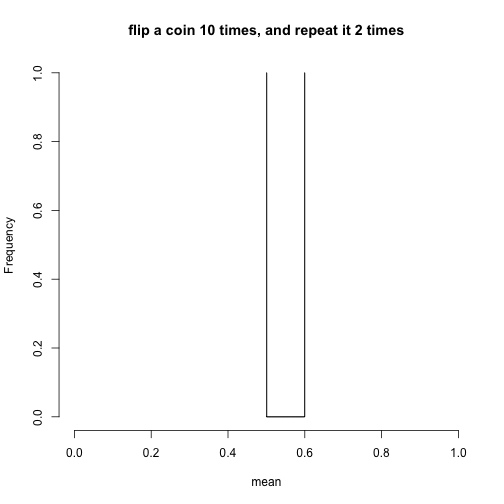
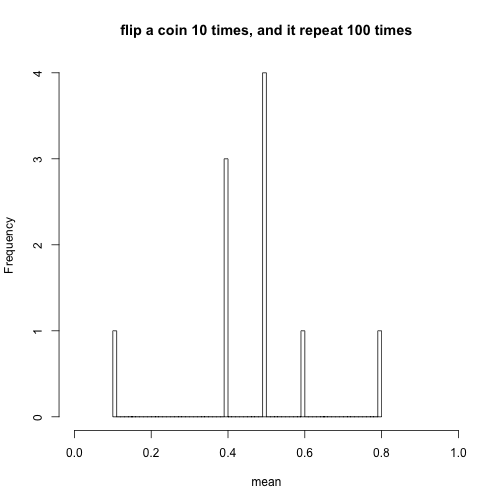
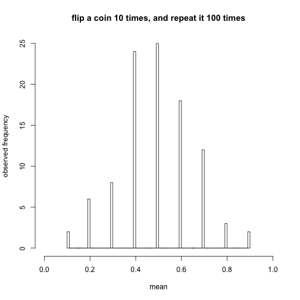
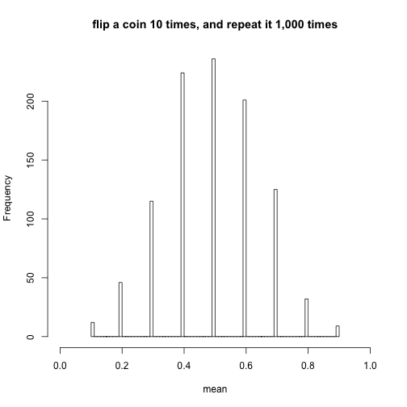
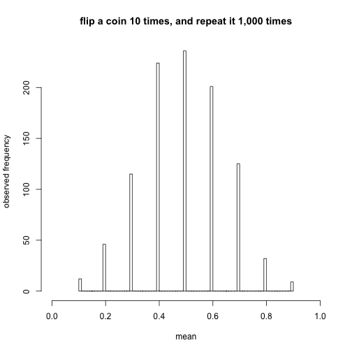
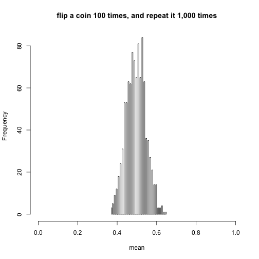

Session2: Hypothesis Testing and ANOVA
========================================================
author: MRC Clinical Sciences Centre (http://mrccsc.github.io/)
date: 12/July/2016
width: 1440
height: 1100
autosize: true
font-import: <link href='http://fonts.googleapis.com/css?family=Slabo+27px' rel='stylesheet' type='text/css'>
font-family: 'Slabo 27px', serif;
css:style.css

Hypothesis testing and ANOVA
========================================================

- SD (standard deviation) and SE (standard error; standard error of sample mean)

- Confidence Interval (CI)

- Hypothesis testing

 -- parametric test:e.g. t-test

 -- non-parametric test: e.g. Wilcoxon test; chi-square test and Fisher's exact test

- Analysis of Variance (ANOVA)


SD and SE (1/)
========================================================


SD and SE - sampling distribution for the mean (2/)
========================================================

If we flip a fair coin 10 times, what is the mean of this experiment?

```r
# always do set.seed() before the random sampling
set.seed(123)
# observation number, number of trials and probability of success on each trial
no.observation=10;
test1<-rbinom(no.observation,1,0.5)
test1
```

```
 [1] 0 1 0 1 1 0 1 1 1 0
```

```r
showmean<-mean(test1)
showmean
```

```
[1] 0.6
```
***

If we flip a fair coin 10 times ***again***, what is the mean of this experiment?

```r
test2<-rbinom(no.observation,1,0.5)
showmean2<-mean(test2)
showmean2
```

```
[1] 0.5
```


SD and SE - sampling distribution for the mean (3/)
========================================================

If we flip a fair coin 10 times, what is the mean of this experiment?

```r
# always do set.seed() before the random sampling
set.seed(123)
# observation number, number of trials and probability of success on each trial
no.observation=10;
test1<-rbinom(no.observation,1,0.5)
test1
```

```
 [1] 0 1 0 1 1 0 1 1 1 0
```

```r
showmean<-mean(test1)
showmean
```

```
[1] 0.6
```
***

If we flip a fair coin 10 times ***again***, what is the mean of this experiment?

```r
test2<-rbinom(no.observation,1,0.5)
showmean2<-mean(test2)
showmean2
```

```
[1] 0.5
```


SD and SE - sampling distribution for the mean (4/)
========================================================

What will happen if we repeat this experiment 10 times, rather than only 2 times

```r
set.seed(123)
no.experiment=10
mat4plot<-matrix(nrow=no.experiment,ncol=1);
no.observation<-10
for (i in 1:no.experiment){
  mat4plot[i,1]<-mean(rbinom(no.observation,1,0.5))
}
hist(mat4plot[,1],xlim=c(0,1),breaks=100,
     xlab="mean",ylab="observed frequency",
     main="flip a coin 10 times, and repeat it 10 times")
```




SD and SE - Central limit theorem (5/)
========================================================

Flip a coin for 10 times, and repeat it for 100 times


***

Flip a coin for 10 times, and repeat it for 1,000 times



SD and SE - Central limit theorem (C.L.T.) (6/)
========================================================

Flip a coin for 10 times, and repeat it for 1,000 times


***
$$\text{the sample mean }\overline X\text{ follows an approximate normal distribution}
  \\
  \overline X\approx Normal\left(\mu,\dfrac{\sigma^2}{n}\right)$$

mean of the sampling distribution of the mean

  $$E(\overline X)=\mu_{\overline X}=\mu$$

variance of the sampling distribution of the mean

$$
  Var(\overline X)=\sigma_{\overline X}^2=\frac{\sigma^2}n \text{or }SE^2=\frac{SD^2}n
  \\ \\
  SE=\frac{SD}{\sqrt n}
  \\
$$

***What will happen if we flip a coin for 100 times and repeat it for 1000 times?***


SD and SE - Central limit theorem (C.L.T.) (7/)
========================================================

Flip a coin for 10 times, and repeat it for 1,000 times



$$
  SE=\frac{SD}{\sqrt{10}}
$$

***

Flip a coin for 100 times and repeat it for 1000 times



$$
  SE=\frac{SD}{\sqrt{100}}
$$


Confidence Interval for proportions (1/)
========================================================

- $$
\begin{aligned}
  \text{distribution of }\hat{p}:
\end{aligned}
$$

*Known*

$$
  \begin{aligned}
  E(\hat{p}) = p.
  \\
  Var(\hat{p})=\frac{p(1-p)}n.
  \\

  \text{C.L.T.: approximately: }
  \\
  \hat{p}\approx Normal\left(p,\;\frac{p(1-p)}n\right).
\end{aligned}
$$

*So*

- $$
\begin{aligned}
  \frac{ \hat{p}-p}{\sqrt{\displaystyle\frac{p(1-p)}n}}\approx Normal\left(0,\;1\right).
\end{aligned}
$$

***

$$
\begin{aligned}
  P(\left|\frac{\widehat p-p}{\sqrt{\displaystyle\frac{p(1-p)}n}}\right|>1.96)\approx5\%.
  \\
  P(\left|\frac{\widehat p-p}{\sqrt{\displaystyle\frac{p(1-p)}n}}\right|\leq1.96)\approx95\%.
  \\
  P(p-1.96\sqrt{\frac{p(1-p)}n}\leq\widehat p\leq p+1.96\sqrt{\frac{p(1-p)}n})\approx95\%.
\end{aligned}
$$

- 95% confidence interval for p

$$
\begin{aligned}
  \left[\hat p-1.96\sqrt{\frac{p(1-p)}n},\;\hat p+1.96\sqrt{\frac{p(1-p)}n}\right].
\end{aligned}
$$


Confidence Interval for means (2/)
========================================================

- $$
\begin{aligned}
  \text{distribution of }\overline X:
\end{aligned}
$$

*Known*

$$
  \begin{aligned}
  E(\overline X) = \mu = \text{true mean}.
  \\
  Var(\overline X)=\frac{\sigma^2}n.
  \\
  \text{C.L.T.: approximately: }
  \\
  \overline X\approx Normal\left(\mu,\;\frac{\sigma^2}n\right).
\end{aligned}
$$

*So*

- $$
\begin{aligned}
  \frac{\overline X-\mu}{\sqrt{\displaystyle\frac{\sigma^2}n}}\approx Normal\left(0,\;1\right).
\end{aligned}
$$

***

$$
\begin{aligned}
  P(\left|\frac{ \overline X-\mu}{\sqrt{\frac{\sigma^2}n}}\right|\leq1.96)\approx95\%.
  \\

  P\left(\overline X-1.96\sqrt{\frac{\sigma^2}n},\;\overline X+1.96\sqrt{\frac{\sigma^2}n}\right)\approx95\%.
\end{aligned}
$$

- $$\text{95% confidence interval for }\overline X$$

$$
\begin{aligned}
  \left[\overline X-1.96\sqrt{\frac{\sigma^2}n},\;\overline X+1.96\sqrt{\frac{\sigma^2}n}\right].
\end{aligned}
$$

- $$\sigma^2\text{ is unknown}$$

*Known*

$$E(S^2)=\sigma^2$$

- $$\text{substitue }\sigma^2=S^2$$


Confidence Interval for means (3/)
========================================================

after substitution, rather than having

$$ \frac{\overline X-\mu}{\sqrt{\displaystyle\frac{S^2}n}}\approx Normal\left(0,\;1\right).$$

we have

$$ \frac{\overline X-\mu}{\sqrt{\displaystyle\frac{S^2}n}}\approx t_{n-1}.$$

$$t_{n-1}:\text{t distribution with n-1 degrees of freedom}.$$


Confidence Interval (CI)
========================================================

Confidence Interval for proportions

$$
\begin{aligned}
  100(1-\alpha)\%\text{ CI for }\hat{p}:
  \\\\
  \hat{p}\pm z_\frac\alpha2\sqrt{\frac{p(1-p)}n}.
\end{aligned}
$$

***

Confidence Interval for means

$$
\begin{aligned}
  100(1-\alpha)\%\text{ CI for }\overline X:
  \\\\
  \overline X\pm t_\frac\alpha2\frac S{\sqrt n}.
\end{aligned}
$$

Statistical tests
========================================================

On top of descriptive statistics, R has several statistical tests covering a range of problems and data types.

Some common tests include:

- var.test() - Comparing 2 variances (Fisher's F test)
- t.test() - Comparing 2 sample means with normal errors (Student's t-test)
- binom.test() - Performs an exact test of a simple null hypothesis about the probability of success in a Bernoulli experiment.
- wilcox.test() - Comparing 2 means with non-normal errors (Wilcoxon's rank test)
- fisher.test() - Testing for independence of 2 variables in a contingency table (Fisher's exact test)


Hypothesis testing for propotions
========================================================

[example: EU referendum reuslt 2016]


Hypothesis testing for propotions
========================================================

[example: EU referendum reuslt 2016]
[data/EU-referendum-result-data.csv]
Is the leaving vote more than the 50%?

```r
vote.leave=17410742
vote.remain=16141241
total.vote=vote.leave+vote.remain
```

CI for the leaving vote
========================================================
Left: 40%

Calculate the 95% CI


```r
alpha.vote=0.05;

phat.vote<-vote.leave/total.vote;

z.vote<-qnorm(alpha.vote/2,
              mean=0,sd=1,
              lower.tail = F)

ME.vote<-z.vote*sqrt(phat.vote*(1-phat.vote)/total.vote)

CI.vote<-phat.vote + c(-ME.vote, ME.vote)
CI.vote
```

```
[1] 0.5187494 0.5190875
```
***

Use the *binom.confint()* from **binom** package


```r
#install.packages("binom")
library("binom")
```


```r
binom.confint(vote.leave, total.vote, conf.level = 0.95, methods = "asymptotic")
```

```
      method        x        n      mean     lower     upper
1 asymptotic 17410742 33551983 0.5189184 0.5187494 0.5190875
```

Hypothesis testing for propotions
========================================================

$$H_0:\text{ Leave vote is equal 50%}
\\
H_a:\text{ Leave vote is not equal to 50%}$$

```r
binom.test(vote.leave, total.vote, p=0.5, alternative = "two.sided")
```

```

	Exact binomial test

data:  vote.leave and total.vote
number of successes = 17411000, number of trials = 33552000,
p-value < 2.2e-16
alternative hypothesis: true probability of success is not equal to 0.5
95 percent confidence interval:
 0.5187493 0.5190875
sample estimates:
probability of success 
             0.5189184 
```
***

$$H_0:\text{ Leave vote is equal 50%}
\\
H_a:\text{ Leave vote is not equal to 50%}$$

```r
prop.test(vote.leave, total.vote, p=0.5, alternative = "two.sided")
```

```

	1-sample proportions test with continuity correction

data:  vote.leave out of total.vote, null probability 0.5
X-squared = 48034, df = 1, p-value < 2.2e-16
alternative hypothesis: true p is not equal to 0.5
95 percent confidence interval:
 0.5187493 0.5190875
sample estimates:
        p 
0.5189184 
```


Hypothesis testing for propotions
========================================================

$$H_0:\text{ Leaving vote is >= 50%}
\\
H_a:\text{ Leaving vote is < 50%}$$

```r
binom.test(vote.leave, total.vote, p=0.5, alternative = "less")
```

```

	Exact binomial test

data:  vote.leave and total.vote
number of successes = 17411000, number of trials = 33552000,
p-value = 1
alternative hypothesis: true probability of success is less than 0.5
95 percent confidence interval:
 0.0000000 0.5190603
sample estimates:
probability of success 
             0.5189184 
```


Hypothesis testing for mean
========================================================
t-test

t-test example - Load data (1/2)
========================================================

We use "PlantGrowth" as example

```r
data("PlantGrowth")
PlantGrowth
```

```
   weight group
1    4.17  ctrl
2    5.58  ctrl
3    5.18  ctrl
4    6.11  ctrl
5    4.50  ctrl
6    4.61  ctrl
7    5.17  ctrl
8    4.53  ctrl
9    5.33  ctrl
10   5.14  ctrl
11   4.81  trt1
12   4.17  trt1
13   4.41  trt1
14   3.59  trt1
15   5.87  trt1
16   3.83  trt1
17   6.03  trt1
18   4.89  trt1
19   4.32  trt1
20   4.69  trt1
21   6.31  trt2
22   5.12  trt2
23   5.54  trt2
24   5.50  trt2
25   5.37  trt2
26   5.29  trt2
27   4.92  trt2
28   6.15  trt2
29   5.80  trt2
30   5.26  trt2
```
***
data visualisation


t-test example - Load data (2/2)
========================================================

Convert the input data into the proper format

```r
#install.packages("tidyr")
library("tidyr")
```

```r
PlantGrowthforwide<-PlantGrowth
PlantGrowthforwide$replicate<-rep(c(1:10),3)
PlantGrowth_wide<-spread(PlantGrowthforwide, group, weight)
head(PlantGrowth_wide)
```

```
  replicate ctrl trt1 trt2
1         1 4.17 4.81 6.31
2         2 5.58 4.17 5.12
3         3 5.18 4.41 5.54
4         4 6.11 3.59 5.50
5         5 4.50 5.87 5.37
6         6 4.61 3.83 5.29
```


t-test example - Calculating variance
========================================================

First we can specify the columns of interest using $ and calculate their variance using var().

```r
var(PlantGrowth_wide$ctrl)
```

```
[1] 0.3399956
```

```r
var(PlantGrowth_wide$trt1)
```

```
[1] 0.6299211
```

```r
var(PlantGrowth_wide$trt2)
```

```
[1] 0.1958711
```

t-test example - Comparing variance
========================================================

Now we can test for any differences in variances between ctrl and trt1 and ctrl and trt2 with an F-test using the var.test() function.

```r
var.test(PlantGrowth_wide$ctrl,
         PlantGrowth_wide$trt1)
```

```

	F test to compare two variances

data:  PlantGrowth_wide$ctrl and PlantGrowth_wide$trt1
F = 0.53974, num df = 9, denom df = 9, p-value = 0.3719
alternative hypothesis: true ratio of variances is not equal to 1
95 percent confidence interval:
 0.1340645 2.1730025
sample estimates:
ratio of variances 
         0.5397431 
```
***

```r
var.test(PlantGrowth_wide$ctrl,
         PlantGrowth_wide$trt2)
```

```

	F test to compare two variances

data:  PlantGrowth_wide$ctrl and PlantGrowth_wide$trt2
F = 1.7358, num df = 9, denom df = 9, p-value = 0.4239
alternative hypothesis: true ratio of variances is not equal to 1
95 percent confidence interval:
 0.4311513 6.9883717
sample estimates:
ratio of variances 
          1.735813 
```

R objects (s3 and s4)
========================================================
Left:30% The data type holding the result var.test() is a little more complex than the data types we have looked.

In R, special objects (S3 or S4 objects) can be created which have methods associated to them. The result from var.test is an object of class htest.

Since we have not come across this before, in order to discover its structure we can use the str() function with the object of interest as the argument.

```r
result <- var.test(PlantGrowth_wide$ctrl, PlantGrowth_wide$trt1)
str(result)
```

```
List of 9
 $ statistic  : Named num 0.54
  ..- attr(*, "names")= chr "F"
 $ parameter  : Named int [1:2] 9 9
  ..- attr(*, "names")= chr [1:2] "num df" "denom df"
 $ p.value    : num 0.372
 $ conf.int   : atomic [1:2] 0.134 2.173
  ..- attr(*, "conf.level")= num 0.95
 $ estimate   : Named num 0.54
  ..- attr(*, "names")= chr "ratio of variances"
 $ null.value : Named num 1
  ..- attr(*, "names")= chr "ratio of variances"
 $ alternative: chr "two.sided"
 $ method     : chr "F test to compare two variances"
 $ data.name  : chr "PlantGrowth_wide$ctrl and PlantGrowth_wide$trt1"
 - attr(*, "class")= chr "htest"
```

R objects (s3 and s4)
========================================================
Now we know the structure and class of the htest object we can access the slots containing information we want just as with a named list.

The p-value

```r
result$p.value
```

```
[1] 0.3718963
```
The statistic

```r
result$statistic
```

```
        F 
0.5397431 
```
The data used in function call

```r
result$data.name
```

```
[1] "PlantGrowth_wide$ctrl and PlantGrowth_wide$trt1"
```

t-test example - Equal Variance
========================================================
We have ascertained that ctrl and trt1 have similar variances. We can therefore perform a standard t-test to assess the significance of differences between these groups.

```r
Result <- t.test(PlantGrowth_wide$ctrl,PlantGrowth_wide$trt1,alternative ="two.sided", var.equal = T)
Result
```

```

	Two Sample t-test

data:  PlantGrowth_wide$ctrl and PlantGrowth_wide$trt1
t = 1.1913, df = 18, p-value = 0.249
alternative hypothesis: true difference in means is not equal to 0
95 percent confidence interval:
 -0.2833003  1.0253003
sample estimates:
mean of x mean of y 
    5.032     4.661 
```

t-test example - Unequal Variance
========================================================
To compare groups of unequal variance then the var.equal argument may be set to FALSE (which is the default).

note: [see exercise]

T-test example. Specifying a formula
========================================================
The same result to that shown could be achieved by specifying a formula for the comparison. Here we wish to compare ctrl versus trt1 so we could simply specify the formula and the data to be used.

```r
data4formula<-PlantGrowth[PlantGrowth$group!="trt2",]
result_formula <- t.test(weight~group,data4formula,alternative ="two.sided", var.equal = T)
result_formula
```

```

	Two Sample t-test

data:  weight by group
t = 1.1913, df = 18, p-value = 0.249
alternative hypothesis: true difference in means is not equal to 0
95 percent confidence interval:
 -0.2833003  1.0253003
sample estimates:
mean in group ctrl mean in group trt1 
             5.032              4.661 
```


ANOVA
========================================================

Compute analysis of variance (or deviance) tables for one or more fitted model objects

- lm()
- anova()


ANOVA - use the anova() function
========================================================

```r
PG.lm<-lm(formula = weight ~ group,
          data = PlantGrowth)
PG.lm
```

```

Call:
lm(formula = weight ~ group, data = PlantGrowth)

Coefficients:
(Intercept)    grouptrt1    grouptrt2  
      5.032       -0.371        0.494  
```
***

```r
PG.anova<-anova(PG.lm)
PG.anova
```

```
Analysis of Variance Table

Response: weight
          Df  Sum Sq Mean Sq F value  Pr(>F)  
group      2  3.7663  1.8832  4.8461 0.01591 *
Residuals 27 10.4921  0.3886                  
---
Signif. codes:  0 '***' 0.001 '**' 0.01 '*' 0.05 '.' 0.1 ' ' 1
```


Wilcoxon test
========================================================

For more details on authoring R presentations click the
**Help** button on the toolbar.

- Bullet 1
- Bullet 2
- Bullet 3

First Slide
========================================================

For more details on authoring R presentations click the
**Help** button on the toolbar.

- Bullet 1
- Bullet 2
- Bullet 3


