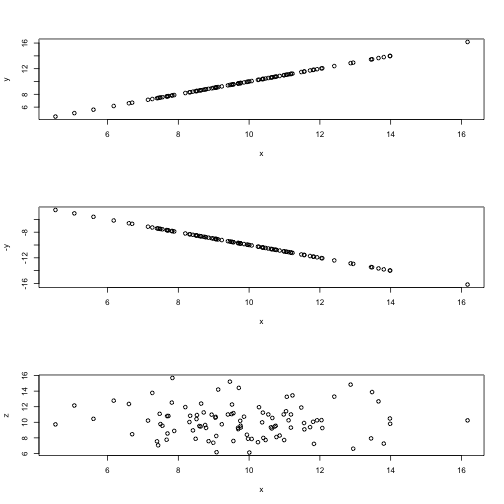
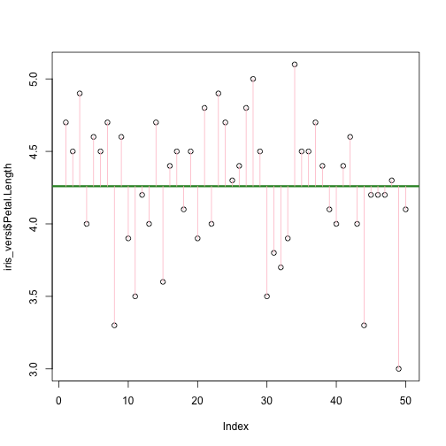
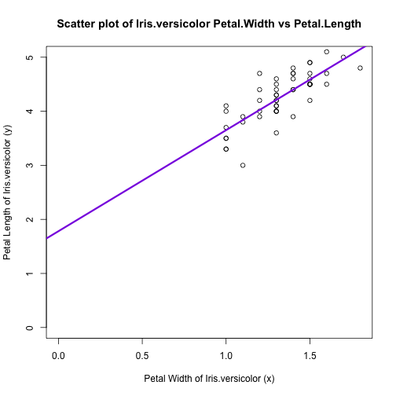

Session3: Linear Regression
========================================================
author: MRC Clinical Sciences Centre (http://mrccsc.github.io/)
date: 12/July/2016
width: 1440
height: 1100
autosize: true
font-import: <link href='http://fonts.googleapis.com/css?family=Slabo+27px' rel='stylesheet' type='text/css'>
font-family: 'Slabo 27px', serif;
css:style.css

Outline
========================================================
- correlation

- linear regression


Dataset - use the "iris" data (1/3)
========================================================
We have used the "iris" data for the [Intermediate R course]. We are going to work on this data again for this session.

Dataset - use the "iris" data (2/3)
========================================================
Some basic checks

```r
class(iris)
```

```
[1] "data.frame"
```

```r
str(iris)
```

```
'data.frame':	150 obs. of  5 variables:
 $ Sepal.Length: num  5.1 4.9 4.7 4.6 5 5.4 4.6 5 4.4 4.9 ...
 $ Sepal.Width : num  3.5 3 3.2 3.1 3.6 3.9 3.4 3.4 2.9 3.1 ...
 $ Petal.Length: num  1.4 1.4 1.3 1.5 1.4 1.7 1.4 1.5 1.4 1.5 ...
 $ Petal.Width : num  0.2 0.2 0.2 0.2 0.2 0.4 0.3 0.2 0.2 0.1 ...
 $ Species     : Factor w/ 3 levels "setosa","versicolor",..: 1 1 1 1 1 1 1 1 1 1 ...
```
***

```r
head(iris)
```

```
  Sepal.Length Sepal.Width Petal.Length Petal.Width Species
1          5.1         3.5          1.4         0.2  setosa
2          4.9         3.0          1.4         0.2  setosa
3          4.7         3.2          1.3         0.2  setosa
4          4.6         3.1          1.5         0.2  setosa
5          5.0         3.6          1.4         0.2  setosa
6          5.4         3.9          1.7         0.4  setosa
```


Dataset - use the "iris" data (3/3)
========================================================
[*intermediate R; add a link to the intermediate R]

```r
# library("dplyr")
# tbl_df()
```

Correlation (1/)
========================================================
- pearson

- spearman

Correlation (2/)
========================================================

```r
cor(iris[,1:4])
```

```
             Sepal.Length Sepal.Width Petal.Length Petal.Width
Sepal.Length    1.0000000  -0.1175698    0.8717538   0.8179411
Sepal.Width    -0.1175698   1.0000000   -0.4284401  -0.3661259
Petal.Length    0.8717538  -0.4284401    1.0000000   0.9628654
Petal.Width     0.8179411  -0.3661259    0.9628654   1.0000000
```

Correlation (3/)
========================================================

```r
pairs(iris[,1:4])
```



Correlation (4/)
========================================================
[probably find an example that requires the spearman method]

```r
cor(iris[,1:4],method="spearman")
```

```
             Sepal.Length Sepal.Width Petal.Length Petal.Width
Sepal.Length    1.0000000  -0.1667777    0.8818981   0.8342888
Sepal.Width    -0.1667777   1.0000000   -0.3096351  -0.2890317
Petal.Length    0.8818981  -0.3096351    1.0000000   0.9376668
Petal.Width     0.8342888  -0.2890317    0.9376668   1.0000000
```

Regression and linear models (1/)
=========================================================

We have seen how we can find the correlation between two sets of variables using cor() function.

R also provides a comprehensive set of tools for regression analysis including the well used linear modeling function lm()

To fit a linear regression we use a similar set of arguments as passed to the t-test fuction in the previous slide.

Regression and linear models (/)
=========================================================
Using the Petal.Width from iris data as example

We could like to use the current information to predict the width of a petal from Iris.versicolor

***

```r
iris_versi<-iris[iris$Species=="versicolor",]

str(iris_versi)
```

```
'data.frame':	50 obs. of  5 variables:
 $ Sepal.Length: num  7 6.4 6.9 5.5 6.5 5.7 6.3 4.9 6.6 5.2 ...
 $ Sepal.Width : num  3.2 3.2 3.1 2.3 2.8 2.8 3.3 2.4 2.9 2.7 ...
 $ Petal.Length: num  4.7 4.5 4.9 4 4.6 4.5 4.7 3.3 4.6 3.9 ...
 $ Petal.Width : num  1.4 1.5 1.5 1.3 1.5 1.3 1.6 1 1.3 1.4 ...
 $ Species     : Factor w/ 3 levels "setosa","versicolor",..: 2 2 2 2 2 2 2 2 2 2 ...
```


Regression and linear models (/)
=========================================================
Try to use the mean of total Petal.Length first

```r
head(iris_versi[,c("Petal.Length",
                   "Species")])
```

```
   Petal.Length    Species
51          4.7 versicolor
52          4.5 versicolor
53          4.9 versicolor
54          4.0 versicolor
55          4.6 versicolor
56          4.5 versicolor
```

```r
mean(iris_versi$Petal.Length)
```

```
[1] 4.26
```
***

```r
plot(iris_versi$Petal.Length)
abline(h=mean(iris_versi$Petal.Length),
       col="forestgreen",lwd=3)
```


Regression and linear models (/)
=========================================================
Try to use the mean of total Petal.Length first


***
In this case, the expected values is  $$ mean  = \bar{y} $$
- residuals (Error)
$$
  \begin{aligned}

  Error_i & = y_i - \bar{y}
  \\ \\
  \end{aligned}
$$
- square of the residuals
- sum of the square of the residuals (SSE)


Regression and linear models (/)
=========================================================
Zoom in [just see 3 data points]


***
In this case, the expected values is  $$ mean  = \bar{y} $$
- residuals (Error)
$$
  \begin{aligned}
  \\
  Error_i & = y_i - \bar{y}
  \end{aligned}
$$
- square of the residuals
$$
  Error_i^2
$$
- sum of the square of the residuals (SSE)


Regression and linear models (/)
=========================================================


```r
lm(formula = Petal.Width ~ Petal.Length, data = iris)
```

```

Call:
lm(formula = Petal.Width ~ Petal.Length, data = iris)

Coefficients:
 (Intercept)  Petal.Length  
     -0.3631        0.4158  
```

Regression and linear models
=========================================================


```r
> lmExample <- read.table("data/lmExample.txt",h=T,sep="\t")
```

```r
> lmResult <- lm(Y~X,data=lmExample)
> plot(Y~X,data=lmExample,main="Line of best fit with lm()",
+      xlim=c(0,150),ylim=c(0,200))
> abline(lmResult,col="red",lty=3,lwd=3)
```



Statistics (21/26) The lm() function
=========================================================

The lm() function fits a linear regression to your data and provides useful information on the generated fit.

In the example below we fit a linear model using  lm() on the lmExample dataset with column Y as the dependent variable and column X as the explanatory variable.


```r
> lmResult <- lm(Y~X,data=lmExample)
> lmResult
```

```

Call:
lm(formula = Y ~ X, data = lmExample)

Coefficients:
(Intercept)            X  
      7.001        1.972  
```

Printing the result from lm() shows the call to lm() and the coefficients including the intercept.

Statistics (22/26) - Plotting line of best fit.
=========================================================

From the previous slides we now know the formula for the line.

**Y = 7.001 + 1.972*X**

We can add the line of best fit using **abline()**


```r
> plot(Y~X,data=lmExample,main="Line of best fit with lm()",
+      xlim=c(0,100),ylim=c(0,200))
> abline(lmResult,col="red",lty=3,lwd=3)
```


Statistics (23/26) - Interpreting output of lm()
=========================================================
As we have seen, printing the model result provides the intercept and slope of line.

To get some more information on the model we can use the summary() function


```r
> summary(lmResult)
```

```

Call:
lm(formula = Y ~ X, data = lmExample)

Residuals:
    Min      1Q  Median      3Q     Max 
-5.0150 -2.3688 -0.2079  2.6068  5.0538 

Coefficients:
            Estimate Std. Error t value Pr(>|t|)    
(Intercept)  7.00053    0.93207   7.511 3.91e-13 ***
X            1.97218    0.01325 148.894  < 2e-16 ***
---
Signif. codes:  0 '***' 0.001 '**' 0.01 '*' 0.05 '.' 0.1 ' ' 1

Residual standard error: 2.858 on 398 degrees of freedom
Multiple R-squared:  0.9824,	Adjusted R-squared:  0.9823 
F-statistic: 2.217e+04 on 1 and 398 DF,  p-value: < 2.2e-16
```


Statistics (24/26) - Residuals
=========================================================


```

Call:
lm(formula = Y ~ X, data = lmExample)

Residuals:
    Min      1Q  Median      3Q     Max 
-5.0150 -2.3688 -0.2079  2.6068  5.0538 

Coefficients:
            Estimate Std. Error t value Pr(>|t|)    
(Intercept)  7.00053    0.93207   7.511 3.91e-13 ***
X            1.97218    0.01325 148.894  < 2e-16 ***
---
Signif. codes:  0 '***' 0.001 '**' 0.01 '*' 0.05 '.' 0.1 ' ' 1

Residual standard error: 2.858 on 398 degrees of freedom
Multiple R-squared:  0.9824,	Adjusted R-squared:  0.9823 
F-statistic: 2.217e+04 on 1 and 398 DF,  p-value: < 2.2e-16
```

***
The **residuals** are the difference between the predicted and actual values.
To retrieve the residuals we can access the slot or use the resid() function.


```r
> summary(resid(lmResult))
```

```
   Min. 1st Qu.  Median    Mean 3rd Qu.    Max. 
-5.0150 -2.3690 -0.2079  0.0000  2.6070  5.0540 
```

```r
> summary(lmResult$residual)
```

```
   Min. 1st Qu.  Median    Mean 3rd Qu.    Max. 
-5.0150 -2.3690 -0.2079  0.0000  2.6070  5.0540 
```
Ideally you would want your residuals to be normally distributed around 0.

Statistics (25/26) - R-squared
=========================================================


```

Call:
lm(formula = Y ~ X, data = lmExample)

Residuals:
    Min      1Q  Median      3Q     Max 
-5.0150 -2.3688 -0.2079  2.6068  5.0538 

Coefficients:
            Estimate Std. Error t value Pr(>|t|)    
(Intercept)  7.00053    0.93207   7.511 3.91e-13 ***
X            1.97218    0.01325 148.894  < 2e-16 ***
---
Signif. codes:  0 '***' 0.001 '**' 0.01 '*' 0.05 '.' 0.1 ' ' 1

Residual standard error: 2.858 on 398 degrees of freedom
Multiple R-squared:  0.9824,	Adjusted R-squared:  0.9823 
F-statistic: 2.217e+04 on 1 and 398 DF,  p-value: < 2.2e-16
```

The **R-squared** value represents the proportion of variability in the response variable that is explained by the explanatory variable.

A high **R-squared** here indicates that the line fits closely to the data.

Statistics (26/26) - F-statistics.
=========================================================


```r
> summary(lmResult)
```

```

Call:
lm(formula = Y ~ X, data = lmExample)

Residuals:
    Min      1Q  Median      3Q     Max 
-5.0150 -2.3688 -0.2079  2.6068  5.0538 

Coefficients:
            Estimate Std. Error t value Pr(>|t|)    
(Intercept)  7.00053    0.93207   7.511 3.91e-13 ***
X            1.97218    0.01325 148.894  < 2e-16 ***
---
Signif. codes:  0 '***' 0.001 '**' 0.01 '*' 0.05 '.' 0.1 ' ' 1

Residual standard error: 2.858 on 398 degrees of freedom
Multiple R-squared:  0.9824,	Adjusted R-squared:  0.9823 
F-statistic: 2.217e+04 on 1 and 398 DF,  p-value: < 2.2e-16
```

The results from linear models also provides a measure of significance for a variable not being relevant.

Statistics (Extra) - A fit line
=========================================================


Statistics (Extra) - Calculating R-squared
=========================================================


Statistics (Extra) - Calculating R-squared
=========================================================


```r
SSE <- sum(resid(lmResult)^2)
TSS <- sum((lmExample$Y - mean(lmExample$Y))^2)
1- SSE/TSS
```

```
[1] 0.982364
```

```r
summary(lmResult)$r.squared
```

```
[1] 0.982364
```

Statistics (Extra) - Calculating F-stat
=========================================================


Statistics (Extra) - Calculating F-stat
=========================================================


```r
MSE <- mean(lmResult$residuals^2)
RSS <- sum((predict(lmResult) - mean(lmExample$Y))^2)

summary(lmResult)$fstatistic
```

```
   value    numdf    dendf 
22169.41     1.00   398.00 
```


Slide With Plot
========================================================


