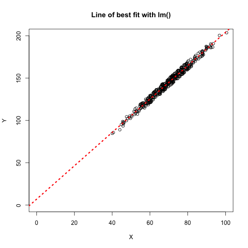

Session3: Linear Regression
========================================================
author: MRC CSC Bioinformatics Core
date: 12/July/2016

First Slide
========================================================

For more details on authoring R presentations click the
**Help** button on the toolbar.

- Bullet 1
- Bullet 2
- Bullet 3

Regression and linear models
=========================================================

We have seen how we can find the correlation between two sets of variables using cor() function.

R also provides a comprehensive set of tools for regression analysis including the well used linear modeling function lm()

To fit a linear regression we use a similar set of arguments as passed to the t-test fuction in the previous slide.


```r
> lmExample <- read.table("data/lmExample.txt",h=T,sep="\t")
```

```r
> lmResult <- lm(Y~X,data=lmExample)
> plot(Y~X,data=lmExample,main="Line of best fit with lm()",
+      xlim=c(0,150),ylim=c(0,200))
> abline(lmResult,col="red",lty=3,lwd=3)
```


Statistics (21/26) The lm() function
=========================================================

The lm() function fits a linear regression to your data and provides useful information on the generated fit.

In the example below we fit a linear model using  lm() on the lmExample dataset with column Y as the dependent variable and column X as the explanatory variable.


```r
> lmResult <- lm(Y~X,data=lmExample)
> lmResult
```

```

Call:
lm(formula = Y ~ X, data = lmExample)

Coefficients:
(Intercept)            X  
      7.001        1.972  
```

Printing the result from lm() shows the call to lm() and the coefficients including the intercept.

Statistics (22/26) - Plotting line of best fit.
=========================================================

From the previous slides we now know the formula for the line.

**Y = 7.001 + 1.972*X**

We can add the line of best fit using **abline()**


```r
> plot(Y~X,data=lmExample,main="Line of best fit with lm()",
+      xlim=c(0,100),ylim=c(0,200))
> abline(lmResult,col="red",lty=3,lwd=3)
```



Statistics (23/26) - Interpreting output of lm()
=========================================================
As we have seen, printing the model result provides the intercept and slope of line.

To get some more information on the model we can use the summary() function


```r
> summary(lmResult)
```

```

Call:
lm(formula = Y ~ X, data = lmExample)

Residuals:
    Min      1Q  Median      3Q     Max 
-5.0150 -2.3688 -0.2079  2.6068  5.0538 

Coefficients:
            Estimate Std. Error t value Pr(>|t|)    
(Intercept)  7.00053    0.93207   7.511 3.91e-13 ***
X            1.97218    0.01325 148.894  < 2e-16 ***
---
Signif. codes:  0 '***' 0.001 '**' 0.01 '*' 0.05 '.' 0.1 ' ' 1

Residual standard error: 2.858 on 398 degrees of freedom
Multiple R-squared:  0.9824,	Adjusted R-squared:  0.9823 
F-statistic: 2.217e+04 on 1 and 398 DF,  p-value: < 2.2e-16
```


Statistics (24/26) - Residuals
=========================================================


```

Call:
lm(formula = Y ~ X, data = lmExample)

Residuals:
    Min      1Q  Median      3Q     Max 
-5.0150 -2.3688 -0.2079  2.6068  5.0538 

Coefficients:
            Estimate Std. Error t value Pr(>|t|)    
(Intercept)  7.00053    0.93207   7.511 3.91e-13 ***
X            1.97218    0.01325 148.894  < 2e-16 ***
---
Signif. codes:  0 '***' 0.001 '**' 0.01 '*' 0.05 '.' 0.1 ' ' 1

Residual standard error: 2.858 on 398 degrees of freedom
Multiple R-squared:  0.9824,	Adjusted R-squared:  0.9823 
F-statistic: 2.217e+04 on 1 and 398 DF,  p-value: < 2.2e-16
```

***
The **residuals** are the difference between the predicted and actual values.
To retrieve the residuals we can access the slot or use the resid() function.


```r
> summary(resid(lmResult))
```

```
   Min. 1st Qu.  Median    Mean 3rd Qu.    Max. 
-5.0150 -2.3690 -0.2079  0.0000  2.6070  5.0540 
```

```r
> summary(lmResult$residual)
```

```
   Min. 1st Qu.  Median    Mean 3rd Qu.    Max. 
-5.0150 -2.3690 -0.2079  0.0000  2.6070  5.0540 
```
Ideally you would want your residuals to be normally distributed around 0.

Statistics (25/26) - R-squared
=========================================================


```

Call:
lm(formula = Y ~ X, data = lmExample)

Residuals:
    Min      1Q  Median      3Q     Max 
-5.0150 -2.3688 -0.2079  2.6068  5.0538 

Coefficients:
            Estimate Std. Error t value Pr(>|t|)    
(Intercept)  7.00053    0.93207   7.511 3.91e-13 ***
X            1.97218    0.01325 148.894  < 2e-16 ***
---
Signif. codes:  0 '***' 0.001 '**' 0.01 '*' 0.05 '.' 0.1 ' ' 1

Residual standard error: 2.858 on 398 degrees of freedom
Multiple R-squared:  0.9824,	Adjusted R-squared:  0.9823 
F-statistic: 2.217e+04 on 1 and 398 DF,  p-value: < 2.2e-16
```

The **R-squared** value represents the proportion of variability in the response variable that is explained by the explanatory variable.

A high **R-squared** here indicates that the line fits closely to the data.

Statistics (26/26) - F-statistics.
=========================================================


```r
> summary(lmResult)
```

```

Call:
lm(formula = Y ~ X, data = lmExample)

Residuals:
    Min      1Q  Median      3Q     Max 
-5.0150 -2.3688 -0.2079  2.6068  5.0538 

Coefficients:
            Estimate Std. Error t value Pr(>|t|)    
(Intercept)  7.00053    0.93207   7.511 3.91e-13 ***
X            1.97218    0.01325 148.894  < 2e-16 ***
---
Signif. codes:  0 '***' 0.001 '**' 0.01 '*' 0.05 '.' 0.1 ' ' 1

Residual standard error: 2.858 on 398 degrees of freedom
Multiple R-squared:  0.9824,	Adjusted R-squared:  0.9823 
F-statistic: 2.217e+04 on 1 and 398 DF,  p-value: < 2.2e-16
```

The results from linear models also provides a measure of significance for a variable not being relevant.

Statistics (Extra) - A fit line
=========================================================


Statistics (Extra) - Calculating R-squared
=========================================================


Statistics (Extra) - Calculating R-squared
=========================================================


```r
SSE <- sum(resid(lmResult)^2)
TSS <- sum((lmExample$Y - mean(lmExample$Y))^2)
1- SSE/TSS
```

```
[1] 0.982364
```

```r
summary(lmResult)$r.squared
```

```
[1] 0.982364
```

Statistics (Extra) - Calculating F-stat
=========================================================


Statistics (Extra) - Calculating F-stat
=========================================================


```r
MSE <- mean(lmResult$residuals^2)
RSS <- sum((predict(lmResult) - mean(lmExample$Y))^2)

summary(lmResult)$fstatistic
```

```
   value    numdf    dendf 
22169.41     1.00   398.00 
```


Slide With Plot
========================================================


