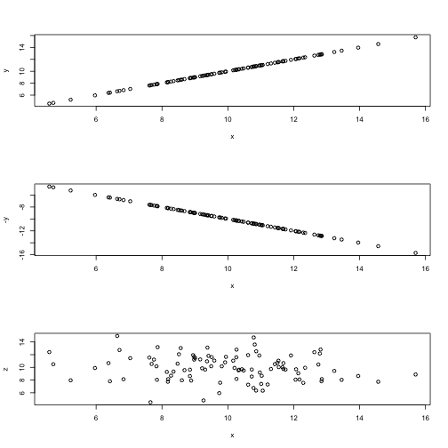
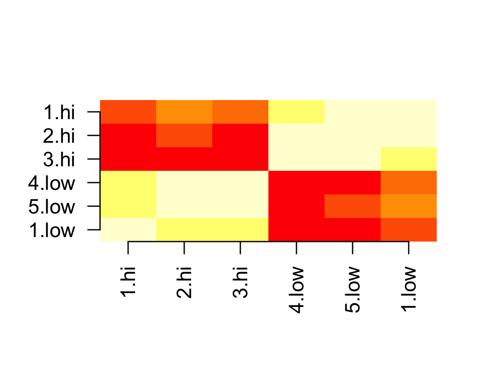
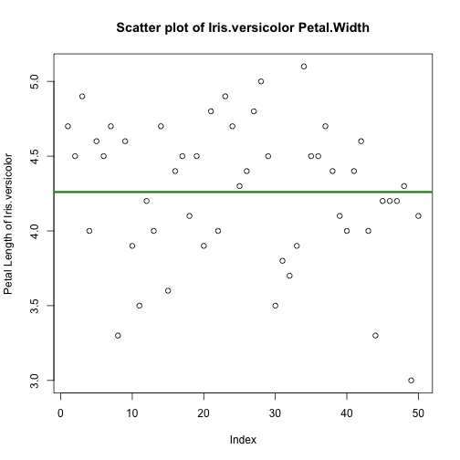
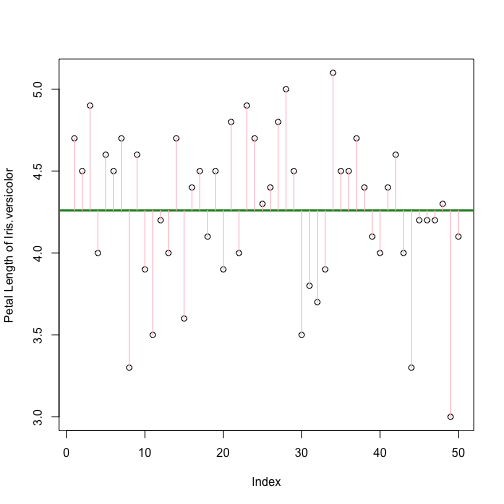
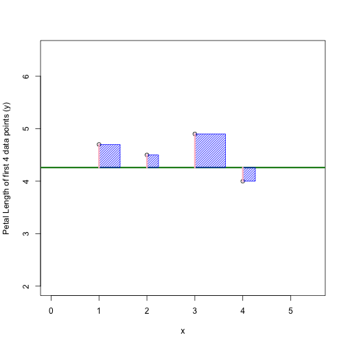
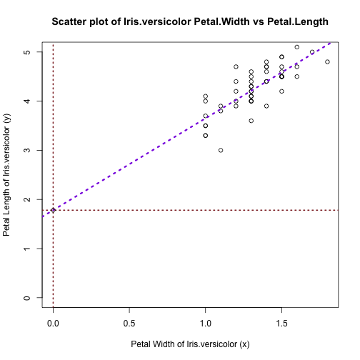
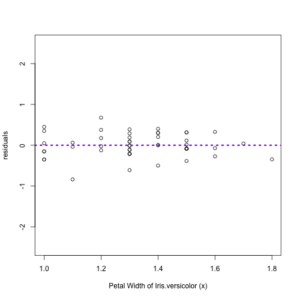
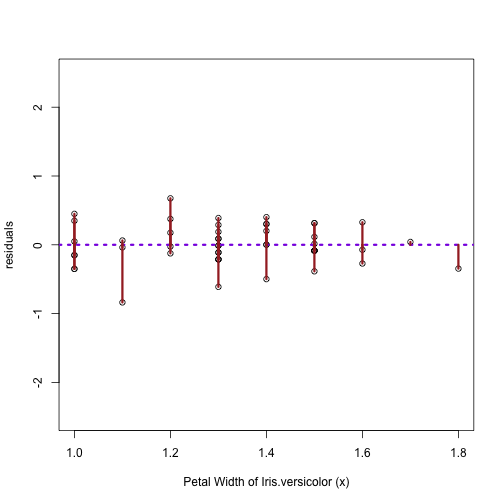
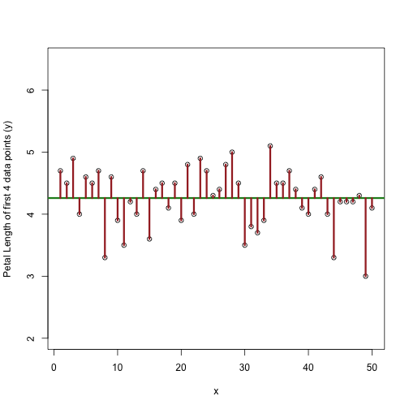

Session3: Correlation and Linear Regression
========================================================
author: MRC Clinical Sciences Centre (http://mrccsc.github.io/)
date: 12/July/2016
width: 1440
height: 1100
autosize: true
font-import: <link href='http://fonts.googleapis.com/css?family=Slabo+27px' rel='stylesheet' type='text/css'>
font-family: 'Slabo 27px', serif;
css:style.css

Outline
========================================================
- correlation

- linear regression


Dataset - use the "iris" data (1/2)
========================================================


```r
> data(iris)
```
Some basic checks

```r
> class(iris)
```

```
[1] "data.frame"
```

```r
> str(iris)
```

```
'data.frame':	150 obs. of  5 variables:
 $ Sepal.Length: num  5.1 4.9 4.7 4.6 5 5.4 4.6 5 4.4 4.9 ...
 $ Sepal.Width : num  3.5 3 3.2 3.1 3.6 3.9 3.4 3.4 2.9 3.1 ...
 $ Petal.Length: num  1.4 1.4 1.3 1.5 1.4 1.7 1.4 1.5 1.4 1.5 ...
 $ Petal.Width : num  0.2 0.2 0.2 0.2 0.2 0.4 0.3 0.2 0.2 0.1 ...
 $ Species     : Factor w/ 3 levels "setosa","versicolor",..: 1 1 1 1 1 1 1 1 1 1 ...
```
***

```r
> head(iris)
```

```
  Sepal.Length Sepal.Width Petal.Length Petal.Width Species
1          5.1         3.5          1.4         0.2  setosa
2          4.9         3.0          1.4         0.2  setosa
3          4.7         3.2          1.3         0.2  setosa
4          4.6         3.1          1.5         0.2  setosa
5          5.0         3.6          1.4         0.2  setosa
6          5.4         3.9          1.7         0.4  setosa
```

Dataset - use the "iris" data (2/2)
========================================================
[Use the dplyr package to make data tidy](http://bioinformatics-core-shared-training.github.io/r-intermediate/)

```r
> #install.packages("dplyr")
> library("dplyr")
```


```r
> # tbl_df()
```

Correlation (1/5)
=========================================================

A common task in statistical analysis is to investigate the relationship between pairs of numeric vectors.

This can be done by identifying the correlation between numeric vectors using the **cor()** function in R.

In this example we use **cor()** to identify the Pearson correlation between two variables.  The **method** argument may be set to make use of different correlation methods.

- Perfectly posively correlated vectors will return 1
- Perfectly negatively correlated vectors will return -1
- Vectors showing no or little correlation will be close to 0.


Correlation between vectors (2/5)
=========================================================


```r
> x <- rnorm(100,10,2)
> z <- rnorm(100,10,2)
> y <- x
> cor(x,y) #
```

```
[1] 1
```

```r
> cor(x,-y)
```

```
[1] -1
```

```r
> cor(x,z)
```

```
[1] -0.1595012
```
***



Correlation over a matrix (3/5)
=========================================================
left: 70%
Often we wish to apply correlation analysis to all columns or rows in a matrix in a pair-wise manner. To do this in R, we can simply pass the **cor()** function a single argument of the numeric matrix of interest. The **cor()** function will then perform all pair-wise correlations between columns.

- subset data.frame

```r
> iris4cor<-iris[,1:4]
```
- change colnames

```r
> colnames(iris4cor)<-gsub("(.+)(\\.)(\\w{3})(.+)","\\1\\2\\3",colnames(iris4cor))
> head(iris4cor)
```

```
  Sepal.Len Sepal.Wid Petal.Len Petal.Wid
1       5.1       3.5       1.4       0.2
2       4.9       3.0       1.4       0.2
3       4.7       3.2       1.3       0.2
4       4.6       3.1       1.5       0.2
5       5.0       3.6       1.4       0.2
6       5.4       3.9       1.7       0.4
```

Correlation over a matrix (4/5)
=========================================================

```r
> cor(iris4cor)
```

```
           Sepal.Len  Sepal.Wid  Petal.Len  Petal.Wid
Sepal.Len  1.0000000 -0.1175698  0.8717538  0.8179411
Sepal.Wid -0.1175698  1.0000000 -0.4284401 -0.3661259
Petal.Len  0.8717538 -0.4284401  1.0000000  0.9628654
Petal.Wid  0.8179411 -0.3661259  0.9628654  1.0000000
```


Correlation (5/6)
========================================================

```r
> pairs(iris4cor)
```




Regression and linear models (1/14)
=========================================================

We have seen how we can find the correlation between two sets of variables using **cor()** function.

R also provides a comprehensive set of tools for regression analysis including the well used linear modeling function **lm()**

To fit a linear regression we use a similar set of arguments as passed to the t-test fuction in the previous slide.

Regression and linear models (2/14)
=========================================================
Use the *Petal.Width* to predict the *Petal.Length* from the iris data as example

We will focus on *Iris.versicolor* as example

***
- subset data *iris*

```r
> iris_versi<-iris[iris$Species=="versicolor", c("Petal.Length","Petal.Width")]
> dim(iris_versi)
```

```
[1] 50  2
```

```r
> head(iris_versi)
```

```
   Petal.Length Petal.Width
51          4.7         1.4
52          4.5         1.5
53          4.9         1.5
54          4.0         1.3
55          4.6         1.5
56          4.5         1.3
```


Regression and linear models (3/14)
=========================================================

If we only know the Petal.Length, and would like to use this information to predict the Petal.Length


```r
> head(iris_versi[,"Petal.Length"])
```

```
[1] 4.7 4.5 4.9 4.0 4.6 4.5
```

```r
> PetalLen.mean<-mean(iris_versi$Petal.Length)
> PetalLen.mean
```

```
[1] 4.26
```
***

```r
> plot(iris_versi$Petal.Length,ylab="Petal Length of Iris.versicolor")
> abline(h=PetalLen.mean, col="forestgreen",lwd=3)
```


Regression and linear models (4/14)
=========================================================

If we only know the *Petal.Length*, and would like to use this information to predict the *Petal.Length*


***

$$\text{In this case, the expected value is mean } = \overline y $$

- residuals (Error)

$$
  \begin{aligned}

  Error_i & = y_i - \overline y
  \\ \\
  \end{aligned}
$$

Regression and linear models (5/14)
=========================================================

Zoom in [just see first 4 data points]


***

$$\text{In this case, the expected values is mean } = \overline y $$

- residuals (Error)

$$
  \begin{aligned}
  \\
  Error_i & = y_i - \overline y
  \end{aligned}
$$
- square of the residuals

$$
  \begin{aligned}
  Error_i^2  = (y_i - \overline y)^2
  \end{aligned}
$$

- sum of the square of the residuals (SSE)

$$
  \begin{aligned}
  SSE  = \sum_{i=1}^{n}(y_i-\overline y)^2
  \end{aligned}
$$

Regression and linear models (6/14)
=========================================================

Now we use the "iris_versi" *Petal.Width* to predict *Petal.Length*

We can plot *Petal.Width* as X and *Petal.Length* as Y


***
$$
  x = \text{independent or explanatory variable}
\\
  y = \text{dependent variable or }f(x)

$$

**$$f(x)  = b_0 + b_1x$$**

$$b_0\text{(intercept): the value of f(x) when x =0}$$

$$b_1\text{(slope): the amount of f(x) will change when x changes 1 unit}$$


Regression and linear models (7/14)
=========================================================
The **lm()** function fits a linear regression to your data and provides useful information on the generated fit.

In the example below we fit a linear model using  **lm()** on the *iris_versi* dataset with *Petal.Length* (Y) as the dependent variable and *Petal.Width* (X) as the explanatory variable.

```r
> lmResult<-lm(formula = Petal.Length ~ Petal.Width, data = iris_versi)
> lmResult
```

```

Call:
lm(formula = Petal.Length ~ Petal.Width, data = iris_versi)

Coefficients:
(Intercept)  Petal.Width  
      1.781        1.869  
```

Interpreting output of lm() (8/14)
=========================================================

As we have seen, printing the model result provides the intercept and slope of line.
To get some more information on the model we can use the **summary()** function

```r
> summary(lmResult)
```

```

Call:
lm(formula = Petal.Length ~ Petal.Width, data = iris_versi)

Residuals:
    Min      1Q  Median      3Q     Max 
-0.8375 -0.1441 -0.0114  0.1984  0.6755 

Coefficients:
            Estimate Std. Error t value Pr(>|t|)    
(Intercept)   1.7813     0.2838   6.276 9.48e-08 ***
Petal.Width   1.8693     0.2117   8.828 1.27e-11 ***
---
Signif. codes:  0 '***' 0.001 '**' 0.01 '*' 0.05 '.' 0.1 ' ' 1

Residual standard error: 0.2931 on 48 degrees of freedom
Multiple R-squared:  0.6188,	Adjusted R-squared:  0.6109 
F-statistic: 77.93 on 1 and 48 DF,  p-value: 1.272e-11
```

Regression and linear models - coefficients (9/14)
=========================================================

```r
> lmResult$coefficients
```

```
(Intercept) Petal.Width 
   1.781275    1.869325 
```
From the $coefficients of object lmResult, we know the equation for the best fit is

**$$Y = 1.781275 + 1.869325 *X$$**

**$$f(x)  = b_0 + b_1x$$**

We can add the line of best fit using **abline()**

$$b_0\text{: the value of f(x) when x =0}$$

$$b_1\text{: the amount of f(x) will change when x changes 1 unit}$$

***


Regression and linear models - residuals (10/14)
=========================================================

The **residuals** are the difference between the predicted and actual values.
To retrieve the residuals we can access the slot or use the **resid()** function.


```r
> summary(resid(lmResult))
```

```
   Min. 1st Qu.  Median    Mean 3rd Qu.    Max. 
-0.8375 -0.1441 -0.0114  0.0000  0.1984  0.6755 
```

```r
> summary(lmResult$residual)
```

```
   Min. 1st Qu.  Median    Mean 3rd Qu.    Max. 
-0.8375 -0.1441 -0.0114  0.0000  0.1984  0.6755 
```
Ideally you would want your residuals to be normally distributed around 0.


Regression and linear models - residuals (11/14)
=========================================================


```r
> IrisLm.res<-lmResult$residual
> head(IrisLm.res)
```

```
        51         52         53         54         55         56 
 0.3016700 -0.0852625  0.3147375 -0.2113976  0.0147375  0.2886024 
```

***

Plot the residuals against the independent variable (X)




Regression and linear models - residuals (12/14)
=========================================================


```r
> IrisLm.res<-lmResult$residual
> head(IrisLm.res)
```

```
        51         52         53         54         55         56 
 0.3016700 -0.0852625  0.3147375 -0.2113976  0.0147375  0.2886024 
```
$$
Error_i = y_i - \hat{y}
\\

Error_i^2  = (y_i - \hat{y})^2
\\
\text{- sum of the square of the residuals (SSE)}
\\
SSE  = \sum_{i=1}^{n}(y_i-\hat{y})^2
$$

***

Plot the residuals against the independent variable (X)




Regression and linear models - residuals (13/14)
=========================================================

Residuals from the model


- Sum of the square of the residuals (SSE)
$$
SSE  = \sum_{i=1}^{n}(y_i-\hat{y})^2
$$

***

Residuals from the mean



- Total Sum of Squares (TSS)

$$
  \begin{aligned}
  TSS  = \sum_{i=1}^{n}(y_i-\overline y)^2
  \end{aligned}
$$


Regression and linear models - R-squared (14/14)
=========================================================
Left: 70%

```

Call:
lm(formula = Petal.Length ~ Petal.Width, data = iris_versi)

Residuals:
    Min      1Q  Median      3Q     Max 
-0.8375 -0.1441 -0.0114  0.1984  0.6755 

Coefficients:
            Estimate Std. Error t value Pr(>|t|)    
(Intercept)   1.7813     0.2838   6.276 9.48e-08 ***
Petal.Width   1.8693     0.2117   8.828 1.27e-11 ***
---
Signif. codes:  0 '***' 0.001 '**' 0.01 '*' 0.05 '.' 0.1 ' ' 1

Residual standard error: 0.2931 on 48 degrees of freedom
Multiple R-squared:  0.6188,	Adjusted R-squared:  0.6109 
F-statistic: 77.93 on 1 and 48 DF,  p-value: 1.272e-11
```
***
- The **R-squared** value represents the proportion of variability in the response variable that is explained by the explanatory variable.

- A high **R-squared** here indicates that the line fits closely to the data.

Regression and linear models - F-statistics.
=========================================================
Left: 70%

```

Call:
lm(formula = Petal.Length ~ Petal.Width, data = iris_versi)

Residuals:
    Min      1Q  Median      3Q     Max 
-0.8375 -0.1441 -0.0114  0.1984  0.6755 

Coefficients:
            Estimate Std. Error t value Pr(>|t|)    
(Intercept)   1.7813     0.2838   6.276 9.48e-08 ***
Petal.Width   1.8693     0.2117   8.828 1.27e-11 ***
---
Signif. codes:  0 '***' 0.001 '**' 0.01 '*' 0.05 '.' 0.1 ' ' 1

Residual standard error: 0.2931 on 48 degrees of freedom
Multiple R-squared:  0.6188,	Adjusted R-squared:  0.6109 
F-statistic: 77.93 on 1 and 48 DF,  p-value: 1.272e-11
```
***
The results from linear models also provides a measure of significance for a variable not being relevant.

Statistics (Extra) - A fit line
=========================================================


Statistics (Extra) - Calculating R-squared
=========================================================


Statistics (Extra) - Calculating R-squared
=========================================================

The fraction of variability in the independent variable (Y; or the *Petal.Length* in this example) that can be explained by the explanatory variable (X; or the *Petal.Width* in this example).

$$
TSS=\text{Total Sum of Squares}=\sum_{i=1}^n(y_i-\overline y)
\\
SSE=\text{Sum of the Square of the residuals}=\sum_{i=1}^n(y_i-\hat{y})
$$


```r
> SSE <- sum(resid(lmResult)^2)
> TSS <- sum((iris_versi$Petal.Length - mean(iris_versi$Petal.Length))^2)
> 1- SSE/TSS
```

```
[1] 0.6188467
```

```r
> summary(lmResult)$r.squared
```

```
[1] 0.6188467
```

Statistics (Extra) - Calculating F-stat
=========================================================


Statistics (Extra) - Calculating F-stat
=========================================================

$$
F=\frac{MSM}{MSE}=\frac{\text{mean of the explained variance}}{\text{mean of the unexplained variance}}=\frac{({\displaystyle\frac{SSM}1})}{({\displaystyle\frac{SSE}{n-2}})}
$$


```r
> #MSE <- mean(lmResult$residuals^2)
> n=nrow(iris_versi)
> MSE <-sum(lmResult$residuals^2)/(n-2)
> RSS <- sum((predict(lmResult) - mean(iris_versi$Petal.Length))^2)
> MSM <-RSS/1
> 
> MSM/MSE
```

```
[1] 77.93357
```

```r
> summary(lmResult)$fstatistic
```

```
   value    numdf    dendf 
77.93357  1.00000 48.00000 
```

Time for an exercise!
========================================================

Exercise on this session can be found [here](exercises/Session3_exercise3.html)


Answers to exercise.
========================================================

Answers can be found [here](answers/Session3_answers3.html)

R code for solutions can be found here  [here]

